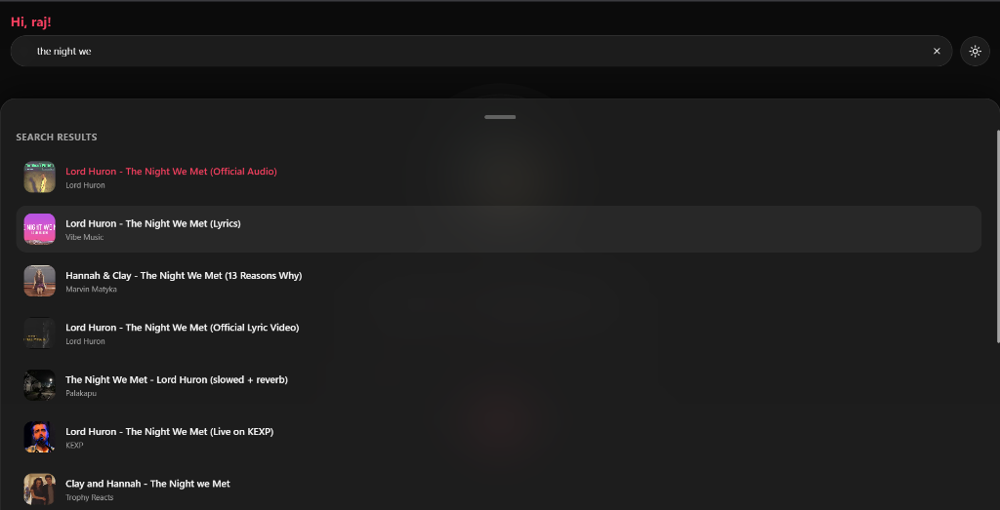
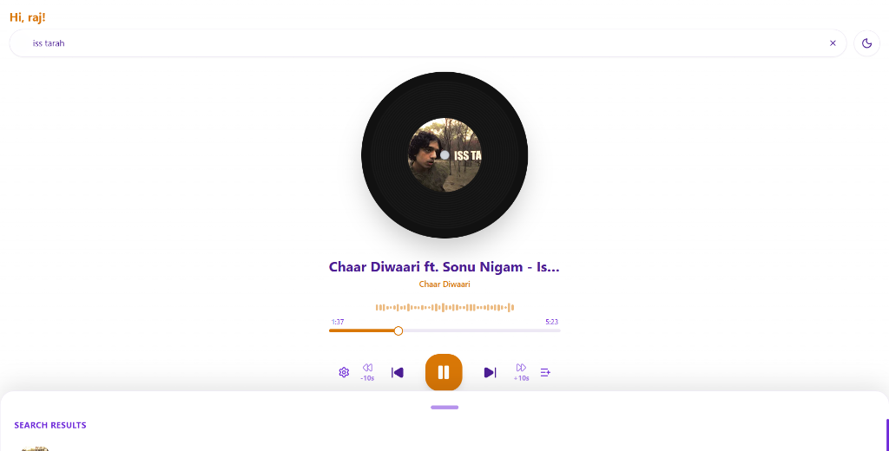

# AudioArc - Music Player

AudioArc is a music streaming application that uses a local FastAPI backend to fetch audio directly from YouTube. This approach ensures high reliability and performance by leveraging your local internet connection for media extraction.

## Screenshots




## Core Features

- **Local Backend Bridge**: Uses a FastAPI server to provide direct, high-speed audio streams.
- **Enhanced Seeking**: Full support for HTTP Range requests for smooth playback scrubbing.
- **Auto-Play**: Automatically plays the next song in the queue or search results.
- **Persistent Theme**: Light and Dark modes that stay active across page navigation.
- **Modern Interface**: Built with React 19 for a fast and fluid user experience.

## Tech Stack

- **Frontend**: React 19, Vite, Tailwind CSS, Zustand, Framer Motion
- **Backend**: Python 3.10+, FastAPI, yt-dlp, httpx
- **Requirement**: FFmpeg is required for optimal audio handling.

## Installation and Setup

### 1. Clone the Repository
```bash
git clone https://github.com/ksrahul23/AudioArc-Music-Player
cd AudioArc-Music-Player
npm install
```

### 2. Configure the Backend
```bash
cd backend
python -m venv venv
.\venv\Scripts\activate  # Windows
# source venv/bin/activate  # Linux/Mac
pip install -r requirements.txt
```

### 3. Run the Application
From the root directory, run:
```bash
npm run dev:all
```
The application will be available at `http://localhost:5173`.

## How it Works

AudioArc bypasses common streaming restrictions by running a local "bridge" server. When you search for or play a song, the React frontend requests metadata and stream URLs from the local FastAPI backend. The backend uses `yt-dlp` to fetch the direct media link, which is then redirected to your browser for native playback.

---
Maintained by Rahul Kumar
